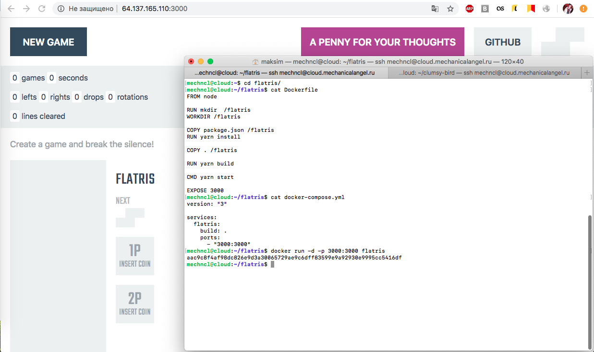

Домашнее задание №1 для интенсива «Как перестать бояться и полюбить DevOps»

>Собрать и локально запустить docker с приложением.
>Затем сделать это при помощи docker-compose.
>Сохраните свои Dockerfile, docker-compose.yml и скриншот запущенного приложения.(Будет плюсом если выложите на Github).

[Демо:](http://64.137.165.110:3000/)

За основу для образа взят [flatris](https://github.com/timurb/flatris).
